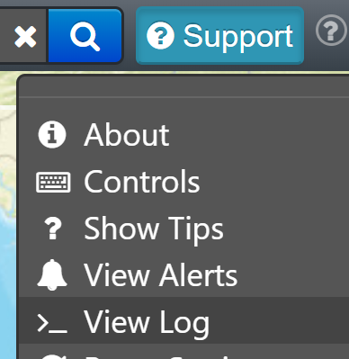
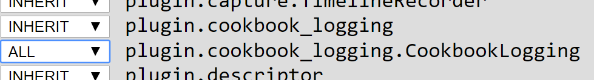

Logging
=======

Problem
-------

Your plugin needs to log different types of information to support debugging or usage metrics.

Solution
--------

Use the OpenSphere logging framework. There are three parts to enable this - adding the logger, using the logger, and adding the applicable :code:`goog.require` entries.

.. literalinclude:: src/cookbook-logging.js
  :caption: Logging Cookbook example - requires
  :linenos:
  :lines: 3-5
  :language: javascript

.. literalinclude:: src/cookbook-logging.js
  :caption: Logging Cookbook example - adding the logger
  :linenos:
  :lines: 22-28
  :language: javascript

.. literalinclude:: src/cookbook-logging.js
  :caption: Logging Cookbook example - using the logger
  :linenos:
  :lines: 41-44
  :language: javascript

Discussion
----------

The OpenSphere logging framework is mostly based on the `Closure logging library functions <https://google.github.io/closure-library/api/goog.log.html>`_. The code above shows the two required argument form (which allows logging at error, warning, info and fine levels) as well as the three required argument :code:`goog.log.log` form (which allows specifying of the log level for more options). Historically OpenSphere has only used the two required argument form (roughly half of the logging using :code:`goog.log.error`, with :code:`goog.log.warning`, :code:`goog.log.info` and :code:`goog.log.fine` sharing the other half reasonably evenly).

.. tip:: If you do need the :code:`goog.log.log` form, use :code:`goog.debug.Logger.Level` instead of :code:`goog.log.Level` to specify the level, in order to avoid logging that works in a debug environment and throws exceptions in a production (minified / compiled) environment.

Having adding logging support to your plugin, you can access logs from within OpenSphere from the Support menu, using the View Logs entry:

Each logger that has been added will appear in the Options menu. The entries for our logger appear as:

Note that there are entries for :code:`plugin.cookbook_logging` and :code:`plugin.cookbook_logging.CookbookLogging`. This makes it easy to configure the appropriate logging levels for your plugin, and for lower level namespaces as needed.

Full code
---------

.. literalinclude:: src/cookbook-logging.js
  :caption: Logging Cookbook example - Full code
  :linenos: 
  :language: javascript
