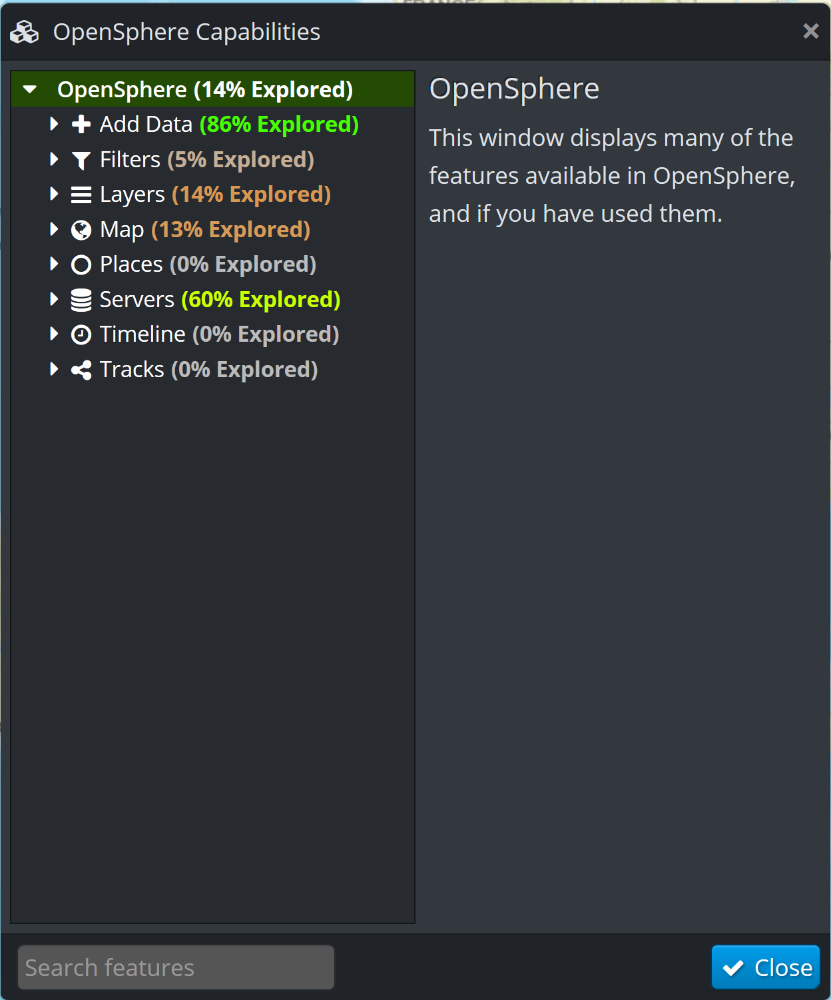
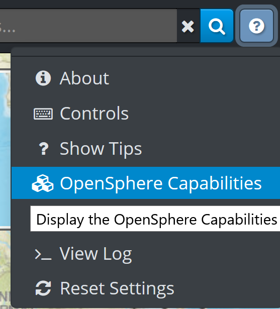
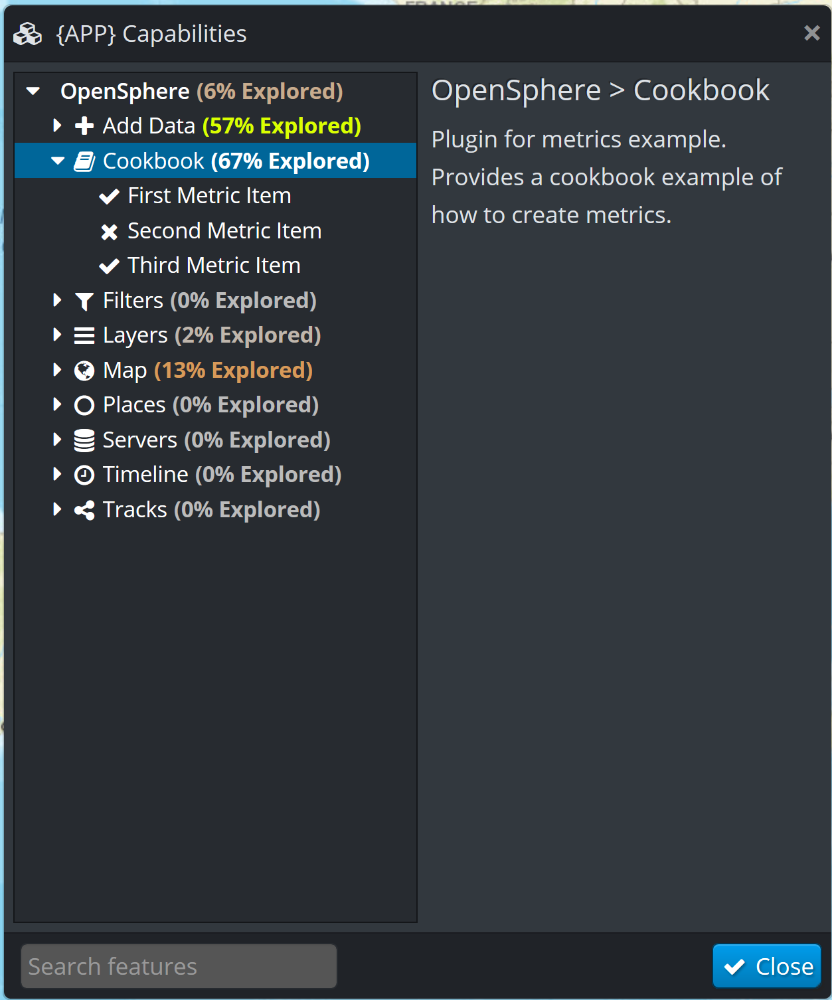

Metrics
=======

Problem
-------

You want your plugin to show up in the "Capabilities" dialog to help users discover your plugin features.

.. note:: This is available from the Support menu, in the top right corner of the main window.

Solution
--------

Use the metrics API to provide your plugin specific functionality.

.. literalinclude:: src/cookbookmetrics.js
  :caption: Metrics Cookbook example - menu creation
  :linenos:
  :language: javascript

The dialog will then have additional items

Discussion
----------

The metrics API can be considered in two parts:

  - setting up the structure that represents what you want to track in terms of usage
  - updating the usage tracking when a particular feature is used

The code shown above sets up the structure. Please ensure that your usage is consistent with the way
other features are shown in the dialog.

Updating the usage so that the dialog shows a tick (check mark) rather than a cross obviously depends on the
how the feature works. However a very common case is when the user makes a menu selection, and this is very
easy to support by adding a ``metricKey`` entry to your menu definition (see Submenu cookbook sample for more on
menus).

.. code-block:: javascript

    group.addChild({
      type: MenuItemType.ITEM,
      eventType: EventType.DO_ANOTHER_THING,
      label: 'Item 1',
      metricKey: Metrics.FIRST_THING,
      handler: handleItem
    });

When the user selects that menu item, the corresponding metric entry will be set.

Some features are less suited to just triggering off a menu item, and a programmatic approach is better.
For example, the ``EXTRA_THING`` key could be triggered by using code like:

.. code-block:: javascript

  OSMetrics.getInstance().updateMetric(Metrics.EXTRA_THING, 1);

In the example, this is triggered by either of the menu items (since the handler is shared). However
a real usage would likely have it matching some specific user behaviour.

Full code
---------

.. literalinclude:: src/index.js
  :caption: Metrics Cookbook Example - ``src/index.js``
  :linenos:
  :language: javascript

.. literalinclude:: src/cookbookmetrics.js
  :caption: Metrics Cookbook Example - ``src/cookbookmetrics.js``
  :linenos:
  :language: javascript

.. literalinclude:: src/cookbookmetricsplugin.js
  :caption: Metrics Cookbook Example - ``src/cookbookmetricsplugin.js``
  :linenos:
  :language: javascript
