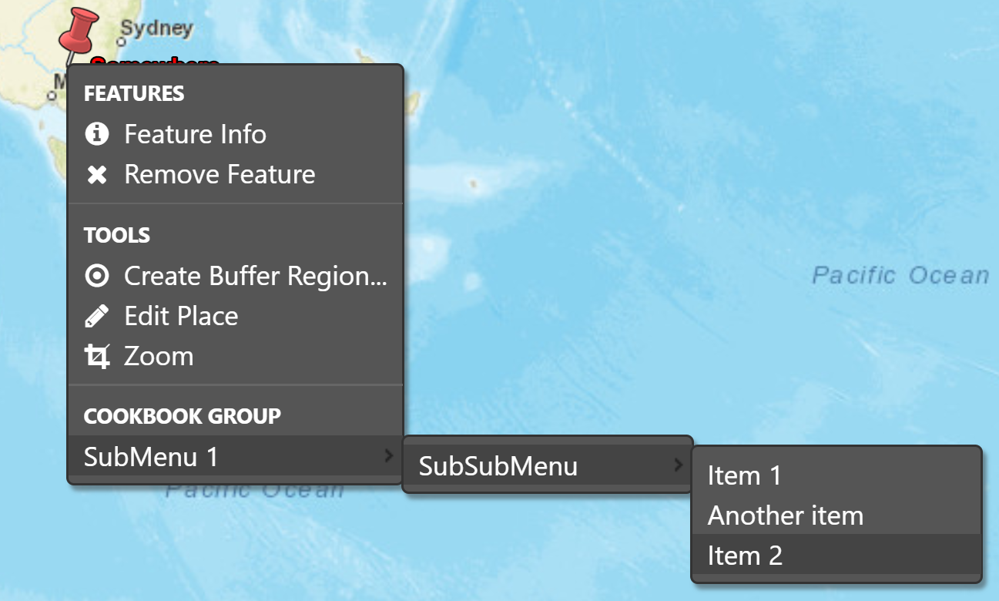

SubMenu
=======

Problem
-------

Your plugin needs to show additional menu entries in a context menu (e.g. the Spatial menu that
appears when you right click on a feature), but you don't want to modify OpenSphere menu code
for your specific case.

Solution
--------

Extend the existing menu with Group, SubMenu and Item elements to provide your plugin specific functionality.

.. literalinclude:: src/cookbook-submenu.js
  :caption: SubMenu Cookbook example - menu creation
  :lines: 45-90
  :linenos: 
  :language: javascript
  
Discussion
----------

The Spatial menu (:code:`os.ui.menu.SPATIAL`) is extensible from plugins. You can then attach groups,
separators, submenus and items (plain items, checkboxes, or radio buttons) to the root, or to
sub-items. In the image and code, a group item is added to the root, then submenus are nested
below that group, and some items are available for selection.

Note that items will be enabled and visible by default, which might not make sense for your use.
Instead, you may want to selectively enable, or not display, some menu items, depending on
the menu context. The usual way to do this is to set a :code:`beforeRender`, as in
:code:`plugin.cookbook_submenu.visibileIfIsPointInSouthernHemisphere_` which is implemented as:

.. literalinclude:: src/cookbook-submenu.js
  :caption: SubMenu Cookbook example - selectable visibility 
  :lines: 106-135
  :linenos: 
  :language: javascript

As the name suggests, one menu entry will only be shown if the feature geometry is a point located
in the southern hemisphere (i.e. negative latitude).
  
Full code
---------

.. literalinclude:: src/cookbook-submenu.js
  :caption: SubMenu Cookbook example - Full code
  :linenos: 
  :language: javascript
