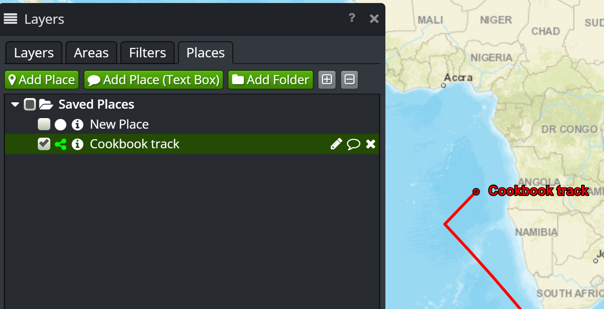

Tracks
======

Problem
-------

You have a data source that updates over time, such as a near-real time track feed.

Example of this could include:

 - Automatic Dependent Surveillance - Broadcast (from aircraft)
 - Automatic Identification System (from shipping)
 - Vehicle tracking systems
 - Radar
 - Military tactical data links

Solution
--------

Use the OpenSphere tracks plugin.

Your code (e.g. plugin) ensures that the tracks plugin is available:

.. literalinclude:: src/tracksplugin_features.js
  :caption: Tracks Cookbook example - requires
  :linenos:
  :lines: 8
  :language: javascript

Your code needs to wait for the Places plugin to be available (fully loaded) before attempting to add the track:

.. literalinclude:: src/tracksplugin_features.js
  :caption: Tracks Cookbook example - Places plugin initialisation
  :linenos:
  :lines: 41-46
  :language: javascript

You can then create a new track, which might be in response to an initial connection, or in response to a server update (e.g. over a WebSocket)

.. literalinclude:: src/tracksplugin_features.js
  :caption: Tracks Cookbook example - Create Track
  :linenos:
  :lines: 52-57,62
  :language: javascript

The track can then be updated with additional features in response to changes:

.. literalinclude:: src/tracksplugin_features.js
  :caption: Tracks Cookbook example - Update Track
  :linenos:
  :lines: 83-86
  :language: javascript

Discussion
----------

The approach shown above will produce the track under the Saved Places layer (on the Places tab), as shown below:

You could create a separate track using :code:`createTrack()` in place of :code:`createAndAdd()`, and then add it to your own layer definition. See the KML
parser implementation for an example of this.

Instead of using features, you can just pass coordinates instead, as shown below:

.. literalinclude:: src/tracksplugin_coordinates.js
  :caption: Tracks Cookbook Coordinates example - Create Track
  :linenos:
  :lines: 52-56
  :language: javascript

.. tip:: In case you missed it, the CreateOptions object has a different key - :code:`coordinates` in place of :code:`features`. You pass exactly one of :code:`coordinates` or :code:`features`.

Similarly, you can pass coordinates to the update method as well:

.. literalinclude:: src/tracksplugin_coordinates.js
  :caption: Tracks Cookbook Coordinates example - Update Track
  :linenos:
  :lines: 81-84
  :language: javascript

.. tip:: With both features and coordinates, you have to make sure your geometry is transformed into the map projection.

While your code could poll for updates, a streaming "server push" may be more appropriate in some scenarios.
OpenSphere has two options for streams:

  - :code:`os.net.LongPoll`
  - :code:`goog.net.WebSocket`

If Web Sockets are supported, prefer :code:`goog.net.WebSocket`.

:code:`os.net.LongPoll` attempts to mimic the :code:`goog.net.WebSocket` interface as much as possible.
There may be other calls needed to setup/teardown streams depending on the remote server's API.

If neither the long poll or websocket options are supported (e.g. direct socket only), then it is not possible to connect from a web application such as OpenSphere.
In this case, you will likely need a server proxy to adapt (e.g. "websockify") your streaming source.

Full code
---------

To avoid the need for a server that provides updates, the example code makes periodic updates to the track position using :code:`setInterval()` and the :code:`modifyPosition_()` function. Those are artifacts of the example, and you wouldn't have that kind of function in your code.

.. literalinclude:: src/tracksplugin_features.js
  :caption: Tracks Cookbook Features variation example - Full code
  :linenos:
  :language: javascript

If you'd prefer to use the coordinates approach, a complete example is shown below:

.. literalinclude:: src/tracksplugin_coordinates.js
  :caption: Tracks Cookbook Coordinates variation example - Full code
  :linenos:
  :language: javascript
