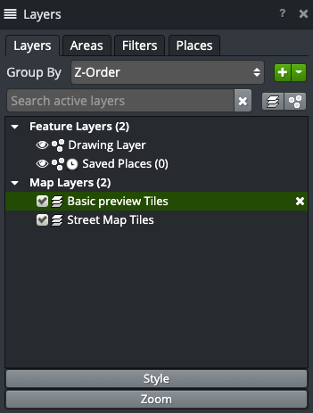

Data Provider
-------------

Here we will add a provider class that reads the ``/index.json`` file from Tileserver and produces layers from it.

A Provider is represented visually by the root nodes in the Add Data window (in its default view). Its goal is to query its server and produce leaf nodes containing Data Descriptors. These leaf nodes are represented visually by the nodes with on/off sliders in that same view, as shown below:

.. image:: images/serveradddata.png

When a layer is turned on, it appears as a node in the layers menu, as shown below:

While most descriptors activate layers, a custom descriptor could activate or launch anything.

First let's just get the JSON loaded.

.. literalinclude:: src/plugin/tileserver/tileserver.js-provider
  :caption: ``src/plugin/tileserver/tileserver.js``
  :linenos:
  :language: javascript

Here's our test for it. Note that this uses the same Jasmine 1.3 that OpenSphere uses. Newer versions allow for async tests with promises. If you have an external plugin and would like to use a newer or different test library, that is up to you.

.. literalinclude:: test/plugin/tileserver/tileserver.test.js-provider
  :caption: ``test/plugin/tileserver/tileserver.test.js``
  :linenos:
  :language: javascript

Run ``yarn test`` to see if it tests properly. Now we need to register our provider type in our plugin.

.. literalinclude:: src/plugin/tileserver/tileserverplugin.js-provider
  :caption: ``src/plugin/tileserer/tileserverplugin.js``
  :linenos:
  :language: javascript
  :emphasize-lines: 3, 6, 33-39

Lastly, we need to update our config so that the application instantiates a copy of our provider.

.. code-block:: json
  :caption: ``config/settings.json``
  
  {
    "admin": {
      "providers": {
        "tileserver-example": {
          "type": "tileserver",
          "label": "Tileserver Example",
          "url": "http://localhost:8081/index.json"
        }
      }
    }
  }

Run the build in OpenSphere and open the debug instance of the application. You should see a copy of the provider in both the Add Data window and in  Settings > Data Servers and you can see our ``console.log`` statement in the Javascript console. However, our server is just spinning and is not processing that JSON yet. Let's fix that next.
