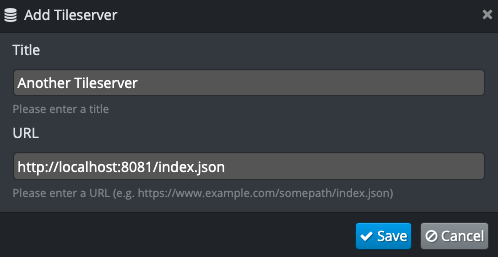

Server Import UI
================

Server type detection differs slightly from file type detection in that it only works on URLs rather than both files and URLs. Let's add a function to detect a Tileserver ``/index.json`` response.

.. literalinclude:: src/plugin/tileserver/tileserverplugin.js-server_ui-1
  :caption: ``src/plugin/tileserver/tileserverplugin.js``
  :linenos:
  :language: javascript
  :emphasize-lines: 46-63

Let's test that.

.. literalinclude:: test/plugin/tileserver/tileserverplugin.test.js-server_ui
  :caption: ``test/plugin/tileserver/tileserverplugin.test.js``
  :linenos:
  :language: javascript
  :emphasize-lines: 1, 21-46

Now we need to make an Angular directive so the user has a form to give the server a title and potentially modify the URL.

.. literalinclude:: src/plugin/tileserver/tileserverimport.js-server_ui
  :caption: ``src/plugin/tileserver/tileserverimport.js``
  :linenos:
  :language: javascript

Note that we do not have our own UI template. We are reusing one from OpenSphere and just overriding a couple of functions in the controller.

Now let's hook that up in our plugin.

.. literalinclude:: src/plugin/tileserver/tileserverplugin.js-server_ui-2
  :caption: ``src/plugin/tileserver/tileserverplugin.js``
  :linenos:
  :language: javascript
  :emphasize-lines: 7, 9, 42-43, 48-49

Save and run the build. Open the debug instance and go to Settings > Data Servers. You can now hit the little view icon on the Tileserver provider in that list. In addition, you can hit "Add Server" and add the URL to the ``index.json``. It will pop up a UI for you to edit the title and the URL, as shown below:

Saving this should save a new copy of the provider across sessions. Edit and Delete should also work as expected. Note that the user cannot edit or delete providers that are configured in settings.

That's pretty much it for providers. If you want to connect to a provider using formats not already supported by OpenSphere, then follow the :ref:`file-parser` and :ref:`file-layer-config` sections of the :ref:`file-type-guide`.
